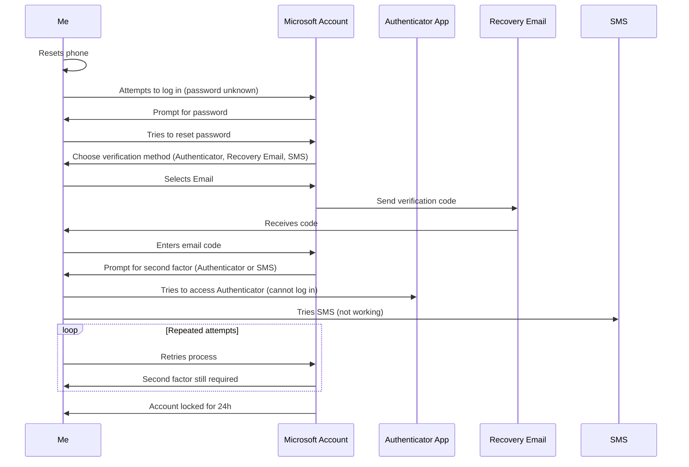

A few weeks ago, I lost access to my email account. That experience opened my eyes to just how much I depended on it and how expensive a “free” service can become when things go wrong.

This is a post-mortem of what happened and what I learned.

<!--more-->


This post is not sponsored or paid by Proton.
I am just writing about what happen to me and the steps I took.
I decided to switch to proton just because I already was paying for their VPN service and I had a good experience.
Other providers I considered are [tuta](https://tuta.com/) and [fastmail](https://www.fastmail.com/)


## The MFA trap: losing access to everything

Few weeks ago changed my Outlook password using my password manager on mobile. If you have ever tried this, you know that sometimes the password gets changed but does not get saved in the manager, especially if you forget to press save. I figured it was not a big deal and that I could reset it later if needed.


The password manager I am using has an issue of not saving rotated password sometimes, you can read more [here](https://www.reddit.com/r/Bitwarden/comments/1hc2z5r/auto_generated_password_not_saved/). It happens, yes, the mistake was preventable but still, why a recovery option is there if it can't be used?


Then my phone broke. I was not too worried, since I had backups and assumed I could recover everything. 

I restored my backup, reinstalled Microsoft Authenticator, and tried to log in. 

But to approve the request on the Authenticator I needed to log in to my Microsoft account, which required the password I had just changed (and not saved).

I then tried to use the password reset option and got prompted to verify my identity using other otpions: the Authenticator (which I could not access without the password), a code to my recovery email, or an SMS. 

I chose the email option, received the code, and entered it. But Microsoft was not satisfied with just that. 

I got prompted with a second code, this time giving me the choice between the Authenticator (still inaccessible) or SMS.

I requested the SMS code. At this point, the system displayed: "Try another verification method" Nothing else.



Trying again I will get the same error and a third time resulted in "Your account has been locked for 24 hours".

I was left completely locked out, unable to authenticate, reset my password, or even understand why my recovery options were blocked.

Here is a brief sequence diagram to resume the situation:



## The sound of silence

I suspect the lockout was triggered by Outlook's Zero Trust policy. Because I changed my password just a few hours before, and then tried to log in from a new device, the system likely flagged this as suspicious activity.

As a result, it silently disabled the SMS recovery method without any warning or explanation. The only feedback I got was the generic "This method is not available" message. Which prompted me to just retry, flagging me even more as suspicious attempt and locking my account even more.

## No way in

Reaching out to support felt like entering a bureaucratic maze. I got send to fill out a recovery form: twenty questions about my account, supposedly checked by a bot. If you get enough right, you get your account back. If not, it is gone forever.

The questions ranged from "What was your Skype name?" to "List ten subjects and exact recipients of emails you sent in the last year."

I tried to recall as many details as possible, even calling friends and colleagues to piece together the information.

Seconds after submitting the form, I received an automated rejection from Microsoft.



I could not recover my account because I had 2FA, but I could not use 2FA because I was locked out. Every support chat in the following days ended with either "Fill out the form again," "Wait 72 hours and try to login again," or "You should just create a new account."

After five rounds of filling out forms and chatting with Outlook support, and begging what I think was a poorly trained LLM to escalte my case, I finally got a call from microsoft. There was just a small issue: It came at 2 AM, my local time. 

Of course, I was asleep and missed it.

## Single Point of Failure: the OAuth Domino effect

Losing access to my Microsoft account was not just about missing email but it broke everything that relied on OAuth2/OIDC.

I could not log in to services like [Tailscale](https://tailscale.com/docs/integrations/identity), which only allow sign ups through OIDC providers and as of 03/2026 only [allows passkey accounts](https://tailscale.com/blog/passkeys) if you get invited to a TailNet by an account that signed up via OIDC . Basically my digital identity had become a single point of failure, locking me out of tools and workspaces.


I don't blame Tailscale for not wanting to handle passwords, they are a pain most of the time.


The consequences went beyond tech. In Italy, you can declare a certified email address tied to your [electronic Identity Card](https://www.cartaidentita.interno.gov.it/en/cie/electronic-identity-card/), which is required to access public administration services.

Guess which email I had registered as my certified address? Exactly. The one I was now locked out of. 

The domino effect was real, and it made me realize just how much this is gonna affect me.

## Any alternative?

Every now and then someone is recommending to "just self-host your mailserver" to escape the tech giants.
Yeah, been there, done that. Anyone who’s actually tried it (and stuck with it) will tell you tahat running your own mail server is nightmerish, not because of the tech stack but mainly because it’s hard keeping your server’s reputation clean without getting blacklisted by the world and honestly I don’t have the time, nor mana for that.


And yes.. I hear you Bob: "then you deserved to get locked out of your email".
Imagine for a second you’re not tech savvy. You barely understand how the internet works, but you still need an email address because it’s 2026 and everything is online. Do you really deserve to be locked out just because you can’t self-host a mail server?


### Proton Mail
After a lot of thinking (and a lot of 72-hour lockouts, thanks Outlook support), I realized the real problem wasn’t Zero Trust policies locking me out which is fair. It was support, run by what felt like a lobotomized LLM failing to understand basic tasks. 

So, following the old "you get what you pay for" mantra, I decided to try paid providers.

It’s a gamble, of course. Support is like security: you don’t realize how much you need it until you really need it. I just hope my money is going into the right bucket.

Since I was already using Proton VPN and had a good experience, I upgraded to the unlimited plan that also offers 24/7 support, just in case.

This time, I’m trying a new approach to email management, since Proton Mail has some genuinely useful features.


if you wanna support me here is a proton mail referral that gives you 20$ to redeem on your next bill if you subscribe using it: https://pr.tn/ref/5JTNAQZW


#### Hide-My-Email Aliases

[Proton bought SimpleLogin](https://proton.me/blog/proton-and-simplelogin-join-forces), a service for creating email aliases. If you’ve got a Proton Pass premium plan (yeah, Proton Pass, not Proton Mail… don’t ask me why), you can spin up aliases using "premium domains", aka these addresses look less like throwaways, so more services will actually accept them.

This is perfect for signing up to sketchy or oneshot services you don’t fully trust. If they start spamming you, just nuke the alias and you’re done with them for good.


As far as I can tell, hide-my-email aliases are receive-only. So, use them for stuff you don’t care about replying to. In the past it happen that some sites wanted me to prove account ownership by sending an email from my registered address, which you can’t do in this case.

EDIT: as ome users on Reddit made pointed out, you can send email from SimpleLogin aliases but you need to download SimpleLogin app, and create a new contact for the alias.


#### Sieve Filters

Another interesting feature of Proton Mail is [Sieve filters](https://proton.me/support/sieve-advanced-custom-filters) basically you can write scripts to handle incoming mails and do actions based on various conditions. 
The system is very powerful but limited by the fact that, since email body is encrypted e2e the filters can't access it.

A small tip I can give is: there are a lot of sieve filters collections on GitHub, some of them are faulty tho, because they all use something like that to include a domain and all the subdomains:

```
if address :matches :domain "from" ["*example.com", ..] {
    doStuff()
}
```

probably because someone wrote it and the rest of the people copy-pasted but that's a very dangerous filter that will actually allow for phishing emails like `notreallyexample.com` to be flagged as correct

In case you want instead include all domains and subdomains the safe way is:

```
if address :domain :matches "from" ["example.com", "*.example.com"] {
    doStuff()
}
```

## TOTP seeds

It makes sense that Microsoft’s Authenticator app requires you to log in, since your TOTP seeds are stored in the cloud and tied to your account. The real problem is that, even after you regain access, there is no way to recover or export your TOTP seeds. Your second factors are effectively trapped inside their ecosystem, with no way to back them up or move them elsewhere.

You can check out [Aegis](https://getaegis.app/) or [Ente Auth](https://ente.io/auth/). Both support e2e cloud backups and, most importantly, let you export your TOTP seeds whenever you want.

## Prepare your readiness kit

Having MFA enabled is always a good thing, the issue occurs when you lost access to the additional factors, for one reason or another. If you happen to have a password manager you probably heard about a readiness kit, it's literally a file that contains informations about what to do to recover your access to your lost account.
That's good and you should have one, but you should also pick providers that allow you to remove your factors using recovery codes. So pick them wisely.

Here are some templates for recovery kits in case you are interested:
- [Bitwarden](https://bitwarden.com/resources/bitwarden-security-readiness-kit/)
- [1password](https://support.1password.com/emergency-kit/)

Regarding this theme, Proton has a feature regarding [Emergency Access](https://proton.me/blog/emergency-access)

## Key takeaways

Losing access to my email was a wakeup call. Here’s what I wish I’d done sooner and what you should do before it’s too late:

- Don’t trust a single provider with your digital life. Always have backups and recovery options outside their ecosystem.
- Use an authenticator app that lets you export your TOTP secrets. 
- Print out recovery codes and stash them somewhere safe. Old-school, but it works when everything else fails.
- Pay for support on accounts that matter. It’s not a guarantee, but it’s better than shouting into the void.
- Write down your own recovery plan. Make sure someone you trust knows where to find it.