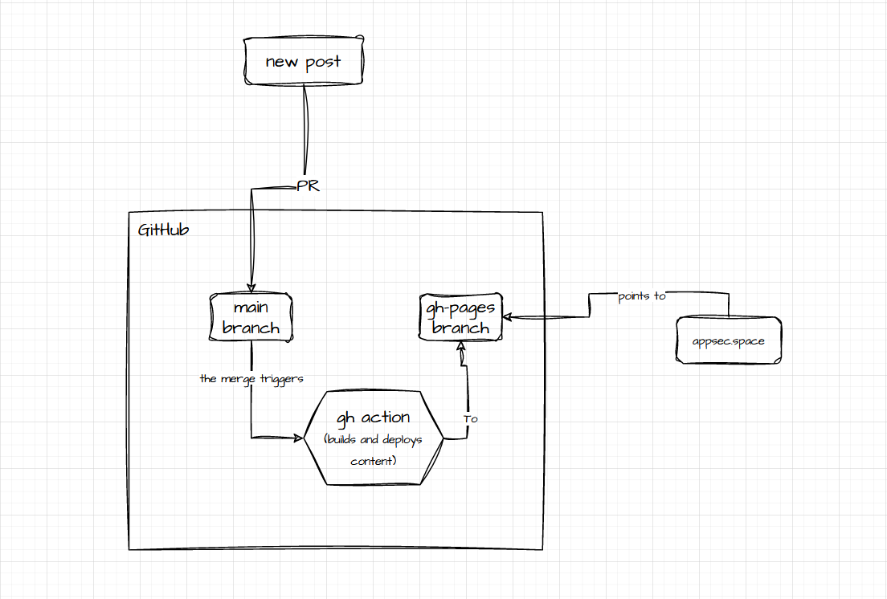

Tanto tempo che non ci si vede, eh? Sono successe tante cose dall'ultimo post nel 2018 sul [vecchio blog](https://bsod.dev).<!--more--> Sfortunatamente non ho scritto molto, sia per mancanza di tempo sia per l'impossibilita' di condivider cio' che ho imparato.
Questo post contiene un'introduzione a questo nuovo sito e come funzionera' d'ora in poi.

Innanzitutto, sono ancora nel campo della security, ma mi sono spostato alla parte di Product Security (di piu' su questo argomento piu' avanti ma TL;DR: noia, carriera e opportunita' di cresita, frustrazione e paura di andare in burnout).

Fortunatamente nel mio attuale lavoro mi vengono concessi tempo e risorse per fare anche vulnerability research quindi occasionalmente postero' alcune vulnerabilita' interessanti che ho trovato.

Vorrei inoltre parlare degli aspetti dell'Application Security a applicata al SDLC, vedremo se funzionera'.

## Il funzionamento di questo blog

Il setup e' molto semplice, uso [hugo](https://gohugo.io/) per buildare pagine statiche che vengono pubblicate su una GithubPage.

C'e' una [Github Action](https://github.com/peaceiris/actions-hugo) che builda e deploya le pagine ogni volta che una Pull Request viene approvata sul branch `main`.

Il tema che uso e' [LoveIt](https://hugoloveit.com/). E' molto carino e ricco di funzionalita' ma ha alcuni bug che devono essere fixati; per esempio, se stai leggendo questa pagina in Italiano ti sarai accorto che l'header ha le traduzioni abbastanza fatte a caso.

La localization del tema e' una feature molto carina ma dover riscrivere ogni volta lo stesso post per ogni linguaggio e' abbastanza tedioso quindi penso che aggiungero' il supporto a DeepL.

    
Infine, il blog ha un nuovo logo:

E' stato generato da [Midjourney](https://midjourney.com) e non significa assolutamente nulla!

## Il futuro
Ho intenzione di cambiare molte cose: prima di tutto vorrei migrare tutti i post del vecchio blog perche' vorreri mantenere un archivio. Successivamente potro' cominciare a scrivere nuovi post.

Se il vecchio blog risponde con un redirect a quello nuovo significa che la migrazione e' stata completata.


Nonostante il nome sia `appsec.space` mi piacerebbe parlare di diversi argomenti, spaziando dall'Application security, al Malware Development (a scopo formativo, [ovviamente](https://www.youtube.com/watch?v=zlbe6BsLCNc)), al mio setup per la produttivita' a lamentele varie.

Il prossimo post sara' sul [Security Theater](https://en.wikipedia.org/wiki/Security_theater) quindi,come diceva qualcuno, ci vediamo li.